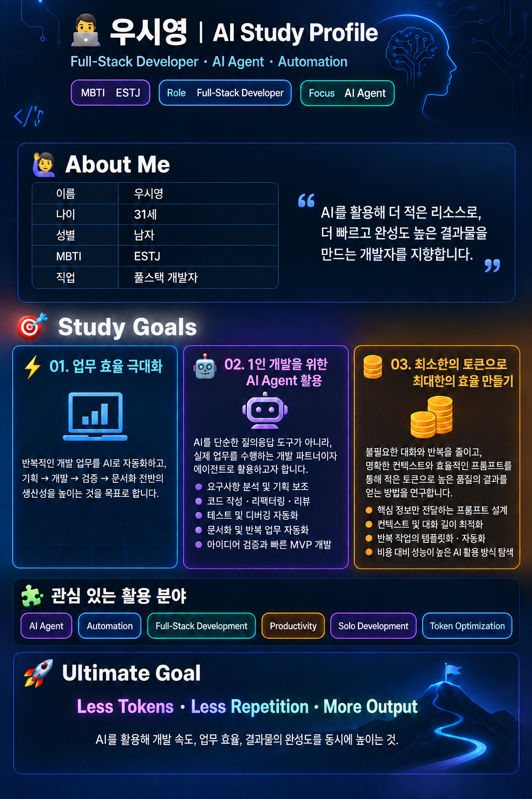

# 자기소개 이미지 생성 대화 기록

이 문서는 자기소개 이미지 `profile.png`를 생성하고 수정한 과정에서 작성된 사용자 프롬프트와 최종 응답 결과를 순서대로 기록합니다.

## 최종 이미지



---

## 1. 자기소개 이미지 생성 및 검증

### 사용자 프롬프트

```text
해당 파일은 나에 대해 설명하는 README 파일이야.
해당 파일에 나와있는 정보를 모두 포함하여 자기소개 이미지를 생성하려고 해.
누락되는 정보가 있어서는 안돼.

생성 후 생성된 이미지와 README의 내용과 다른 부분이 없는지 검증 진행해줘.

이미지 파일은 siyoungwoo/week1 하위에 profile.png 파일로 생성해줘.
```

### 응답 결과

생성 및 검증을 완료했습니다.

- 결과 파일: [profile.png](C:/Users/Seeds/IdeaProjects/study-ai/siyoungwoo/week1/profile.png)
- 규격: PNG, 1024×1536
- 생성 방식: 내장 이미지 생성 도구
- 검증 결과: README의 기본 정보, 학습 목표 3개, 세부 항목 9개, 관심 분야 6개, Ultimate Goal까지 누락·내용 변경·텍스트 잘림 없이 포함됐습니다.
- 최종 프롬프트: README 원문을 그대로 유지하고 원문 외 문구는 제거한 세로형 개발자 프로필 인포그래픽 제작.

---

## 2. 소개 문구 위치 수정

### 사용자 프롬프트

```text
**AI를 활용해 더 적은 리소스로, 더 빠르고 완성도 높은 결과물을 만드는 개발자를 지향합니다.** &#x20;
이 내용을 About Me 옆 섹션으로 옮기고 상단의 기존내용은 삭제하는게 가독성이 더 좋은 것 같아.
```

### 응답 결과

수정 완료했습니다.

- 해당 문장을 상단에서 삭제
- About Me 오른쪽 영역에 인용문 형태로 이동
- 나머지 정보와 디자인 유지
- 문구 중복·누락·오탈자 및 저장 파일 해시 검증 완료

수정 파일: [profile.png](C:/Users/Seeds/IdeaProjects/study-ai/siyoungwoo/week1/profile.png)

내장 이미지 편집 도구를 사용했으며, 최종 프롬프트는 “지정 문장만 이동하고 나머지 요소는 그대로 유지”하는 방식으로 적용했습니다.

---

## 3. 대화 기록 문서 생성

### 사용자 프롬프트

```text
이제 내가 작성한 프롬프트와 너의 응답 결과가 포함되도록 생략 없이 prompt.md 파일로 동일한 디렉터리에 생성해줘.
해당 파일은 가독성을 위해 마크다운 문법을 사용해서 생성해줘.
```

### 응답 결과

`prompt.md`를 생성했습니다.

- 파일: [prompt.md](C:/Users/Seeds/IdeaProjects/study-ai/siyoungwoo/week1/prompt.md)
- 포함 범위: 현재 대화의 사용자 프롬프트 3개, 각 최종 응답 및 생성된 이미지 링크
- 형식: 제목, 구분선, 코드 블록, 목록과 이미지 링크를 사용한 Markdown

